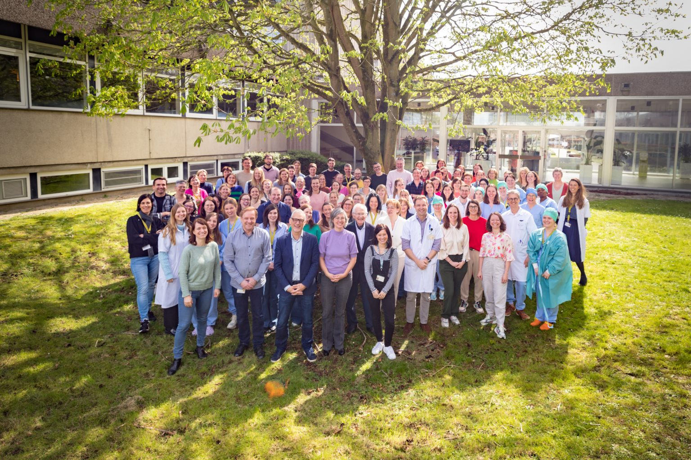

# Prevent thousands of inherited diseases before they are transmitted

## Vision

Rare diseases are not a medical niche. Orphanet lists approximately **6,500
rare diseases**, nearly **72% of which are genetic**. Together, they affect an
estimated **3.5% to 5.9% of the global population**.[^1]

For comparison, the Human Disease Ontology contains approximately **12,000
disease classes**, spanning genetic, infectious, environmental, malignant,
rare, and common diseases. In this taxonomy, rare diseases therefore represent
roughly half of all catalogued entities, although the classifications do not
perfectly overlap.[^2]

Most importantly, we are not referring to simple statistical associations
between a gene and a disease. In our extraction from ClinVar and the Human
Phenotype Ontology:

- **6,706 OMIM phenotypes** have at least one germline variant classified as
  pathogenic or likely pathogenic;
- **3,617** have an autosomal recessive mode of inheritance;
- **2,591** have an autosomal dominant mode of inheritance;
- **367** are X-linked;
- after deduplication, **6,415 phenotypes** fall under at least one of these
  three modes of inheritance.

These are thousands of diseases for which a causal alteration and an
inheritance mechanism are known—not merely genetic correlations.[^3]

Not all of these diseases are severe, early-onset, penetrant, or relevant to
embryo selection. Our product therefore begins with severe, clinically
validated, reproductively actionable monogenic diseases, before gradually
expanding its scope.

## The problem

Medicine still intervenes primarily after disease onset: diagnosis, chronic
treatment, hospitalisation, disability, and, in some cases, gene therapy.

In the United States alone, a study of **379 rare diseases** estimated their
societal cost at **$966 billion in 2019**, including healthcare, non-medical
expenses, and productivity losses. Another NIH-supported study estimates the
direct medical costs of rare diseases alone at approximately **$400 billion per
year** in the United States.[^4]

At the same time, more than **1,500 cell and gene therapy clinical trials** are
active worldwide across all indications. We devote considerable resources to
treating these diseases after they appear, even though some transmission risks
can be identified in advance.

## Our solution

We are developing a reproductive-risk reduction platform based on sequencing
prospective parents.

Our first product provides:

- whole-genome sequencing for both prospective parents;
- detection of relevant pathogenic monogenic variants;
- couple-specific transmission-risk calculations;
- medical interpretation and genetic counselling;
- guidance towards appropriate reproductive options;
- a portable genomic record that can be reused for future pregnancies and
  personal health.

The mechanism depends on the mode of inheritance.

### Autosomal recessive diseases

When both parents carry a pathogenic variant in the same recessive gene, each
pregnancy generally has:

- a 25% chance of an affected child;
- a 50% chance of an unaffected carrier child;
- a 25% chance of a child carrying neither familial variant.

### X-linked recessive diseases

When the mother carries an X-linked recessive variant, each son generally has a
50% chance of inheriting the variant and being affected. Daughters may be
non-carriers, carriers, or, in some cases, have clinical manifestations.

### Autosomal dominant diseases

When one parent carries an autosomal dominant pathogenic variant, each embryo
generally has a **50% chance** of inheriting it. This includes paediatric,
neurological, and cardiovascular diseases, as well as some later-onset
conditions and inherited predisposition syndromes.

### X-linked dominant diseases

A single variant may be sufficient to transmit the disease. Risk and clinical
presentation depend in particular on the carrier parent, the child's sex, and
the penetrance and expressivity of the variant.

In these situations, IVF with PGT-M can test embryos for the familial variant
and make it possible to prioritise embryos that do not carry it for transfer.
This is embryo selection, not genetic editing. The HFEA states that PGT-M can
be used for almost any genetic condition for which the precise causal gene is
known.[^5]

Our promise is therefore not to cure disease in a child who is already ill. It
is to help a family identify a known causal risk before conception and, if it
chooses, sharply reduce the risk of transmitting that specific disease.

> **$1,000 to identify and prevent 1 in 3 diseases in your children.**

## Two complementary markets

### 1. All recessive monogenic diseases

The first market covers **all recessive monogenic diseases**, whether autosomal
or X-linked. Prospective parents are often healthy and unaware that they carry
a pathogenic variant that could be transmitted.

A systematic review of expanded carrier-screening programmes found that
between **0.1% and 8% of couples were high-risk**, depending on the population
and the number of conditions screened.[^6]

### 2. All actionable dominant monogenic diseases

The second market covers **dominant monogenic diseases**. A parent may be
affected, presymptomatic, or carry a predisposition with incomplete penetrance.
When heterozygous for the pathogenic variant, each embryo generally has a 50%
chance of inheriting it.

In a cohort of nearly 22,000 people, **2.54%** carried a pathogenic or likely
pathogenic variant in one of the 59 medically actionable genes then recommended
by the ACMG. A Dutch study found a comparable result of **2.7%**.[^7]

Not all such variants are severe, highly penetrant, or automatically eligible
for PGT-M. They nevertheless show that actionable dominant risk is far from a
marginal market.

BRCA1 and BRCA2 illustrate this second category. A carrier does not necessarily
have cancer, but has a significant and medically actionable inherited
predisposition. PGT-M for BRCA already exists: in France, it may be authorised
case by case based on personal and family severity. One Paris centre reported
46 requests involving BRCA1 or BRCA2.[^8]

Our market can therefore progressively cover the full spectrum of actionable
inherited monogenic diseases: autosomal recessive, X-linked recessive or
dominant, and autosomal dominant.

## A pathway, not mandatory IVF

When a high risk is discovered, our role is to offer consultation in genetics
and reproductive medicine. IVF with PGT-M is one option, alongside natural
conception, prenatal diagnosis, donor gametes, or choosing not to intervene.

The decision belongs to the prospective parents.

In France, PGT remains restricted to cases with a proven risk of transmitting
a genetic disease considered particularly severe and incurable. Each indication
is assessed individually. In 2023, technical PGT procedures had been developed
in France for **536 different diseases involving 491 genes**.[^9]

<!-- PAGEBREAK -->

## Launch partner — Dante Omics

### Scale parental sequencing without immediately building a laboratory

Founded in Italy, Dante Omics offers whole-genome sequencing, B2B services for
hospitals and companies, and infrastructure combining Illumina and MGI
platforms. Its value to Jouvence is the ability to provide an outsourced WGS
workflow quickly, while Jouvence retains control of the product, consent,
reproductive interpretation, and participant relationship.[^18]

| Value to Jouvence | Use during the pilot | Asset retained by Jouvence |
|---|---|---|
| Parental WGS at scale | Avoid initial laboratory CAPEX | Product, cohort, and participant relationship |
| Direct-to-participant logistics | Test a distributed European pathway | Consent and user experience |
| Raw genomic data | Build our reproductive pipeline | Models, rules, and knowledge base |
| B2B and overflow capacity | Absorb gradually increasing volume | Data portability and governance |

### Proposed role in the first phase

- sequence both prospective parents using WGS with contractual quality metrics;
- deliver raw and derived files in standardised formats;
- enable rapid confirmation of selected variants before clinical use;
- progressively transfer methods as Jouvence builds its own capacity.

Dante is an **industrial candidate to audit**, not yet a validated partner.
Before launch, Jouvence must verify the geographic and clinical scope of its
certifications, data residency, chain of custody, actual turnaround times,
support, reanalysis, and exit terms. This diligence is what turns a testing
vendor into a reliable industrial partner.

<!-- PAGEBREAK -->

## Clinical partner — Brussels IVF

### An integrated fertility, medical genetics, and PGT pathway

Brussels IVF brings together a reproductive-medicine centre, an embryology
laboratory, and the UZ Brussel Centre for Medical Genetics on one campus. The
centre began operating in 1983, reports more than 50,000 births resulting from
its treatments, and initiated **1,123 PGT cycles in 2024**.[^19]

| Capability | Why it matters | Jouvence application |
|---|---|---|
| IVF, ICSI, and embryo biopsy | Complete clinical pathway | Care for at-risk couples |
| On-site medical genetics | Specialist interpretation and counselling | Validation of PGT-M indications |
| Family-specific PGT development | Custom SNP testing and haplotyping | Rare variants and complex families |
| Cryopreservation | Continuity of reproductive care | Embryo and gamete storage |
| Follow-up of children born after PGT | Long-term safety data | Prospective clinical validation |

Belgian law prohibits selection for non-pathological genetic traits and
non-medical sex selection, but does not reproduce Spain's strict three-part
test of “serious, early-onset, and without curative treatment.” PGT must be
performed by a fertility centre collaborating with a human-genetics centre.
This structure leaves more room for medical assessment of individual cases,
without permitting general genetic selection.[^20]

### Proposed role in the first phase

- co-design the initial catalogue of reproductively actionable diseases and genotypes;
- validate parental variants and develop the corresponding PGT-M tests;
- perform the first IVF-PGT pathways and document their performance;
- prepare a prospective concordance study covering parental WGS, PGT-M, and prenatal or postnatal confirmation.

<!-- PAGEBREAK -->

## Business plan — from partnerships to proprietary infrastructure

Our strategy deliberately separates clinical validation from industrial build.
We begin with partners that can operate today, then internalise the components
that create the greatest value, control, and margin.

| Phase | Indicative timeline | Operating model | Evidence sought |
|---|---|---|---|
| 1. Partner pilot | 0–18 months | Outsourced WGS; Jouvence analysis; PGT at Brussels IVF | Feasibility, quality, acceptability, and first complete pathways |
| 2. Jouvence platform | 12–36 months | Proprietary pipeline, participant portal, curation, and clinical coordination | Reproducibility, automation, and lower cost per case |
| 3. Proprietary sequencing | 3–5 years | European WGS laboratory with an overflow partner | Control of turnaround, quality, data, and margin |
| 4. PGT platform | 5+ years | Authorised PGT laboratory and clinical network, alone or in a joint venture | Multiplexing, European scale, and vertical integration |

### First step: small-scale trials

The pilot must be small enough to remain controlled, yet structured enough to
produce clinical and economic evidence:

- an initial cohort of **50 to 100 couples**, enriched for already documented genetic situations;
- parental WGS and targeted reanalysis in the Jouvence pipeline;
- multidisciplinary review of pathogenic or likely pathogenic variants;
- referral of an eligible subset to genetic counselling and PGT-M;
- measurement of turnaround time, total cost, actionable-result rate, satisfaction, and analytical concordance.

### What we internalise first

| Own early | Rent initially | Internalise after validation |
|---|---|---|
| Consent and governance | Sequencers and wet laboratory | WGS production |
| Reproductive-risk pipeline | Sample logistics | Targeted clinical confirmation |
| Data and participant relationship | IVF, biopsy, and cryostorage | Multiplex PGT development |
| Disease–variant–genotype catalogue | Clinical PGT infrastructure | Centre network and PGT platform |

This trajectory limits capital committed before market validation while
building Jouvence's differentiating assets from day one.

<!-- PAGEBREAK -->

## Vision — an active genomic community

Sequencing is not a static report received once. It becomes personal
infrastructure supporting health, research, and family plans throughout life.

> **Sequence once. Learn for life. Decide together what science should answer next.**

| Horizon | Product | Participant value | Envisioned model |
|---|---|---|---|
| Today | WGS and reproductive risk | Understand transmissible risks | €500 per person |
| Next | Genomic subscription | Secure storage and new guidance | **$5 per month** |
| Next | Citizen science | Choose questions and help answer them | Free with voluntary community data sharing |
| Reproductive extension | Gamete preservation | Preserve future family options | Annual storage and partner pathways |
| Research horizon | In vitro gametogenesis | New options for infertility and some same-sex couples | Only after clinical and regulatory validation |

### One minute a week to steer science

Each member will be able to join a simple citizen-science loop:

- propose and vote for the next research question;
- answer a questionnaire taking approximately **one minute per week**;
- follow analytical progress and collective results;
- decide separately which academic or commercial projects may use their data.

This genomic, phenotyped, recontactable cohort can answer questions selected
with participants, instead of treating them as mere data suppliers.

### Three ways to fund your genome

| Option | Contribution | Benefit |
|---|---|---|
| Private subscription | $5 per month | Storage, reanalysis, and new personalised guidance |
| Community access | Optional, granular, revocable consent | Free or subsidised subscription where legally permitted |
| Value sharing | Participation in a commercial project that actually generates revenue | Share of distributable net revenue, with no guaranteed payment |

### From preservation to new family possibilities

Jouvence can first coordinate and then offer, with authorised centres,
cryopreservation and storage of sperm, oocytes, and embryos. In the longer term,
in vitro gametogenesis could create new options for some people with infertility
and some same-sex couples. It remains experimental today and will become a
product only after its safety, efficacy, and legality have been demonstrated.[^17]

<!-- PAGEBREAK -->

## Market size — the genome as a universal product

The initial market is reproductive, but the fundamental product is individual:
every person may want a complete, portable, reanalysable genome once in their
lifetime. At **€500 per person**, the theoretical market is therefore not
limited to prospective parents.

| Theoretical market | Reference population | Individual price | One-off TAM |
|---|---:|---:|---:|
| France | 69.1 million | €500 | **€34.5bn** |
| European Union | 452.0 million | €500 | **€226.0bn** |

France had 69.082 million residents on 1 January 2026. The European Union had
approximately 452.0 million residents at the same date.[^10][^11]

### An immediately addressable reproductive entry point

The annual market of new family projects is a more credible initial segment
than immediate conversion of the entire population. Using two people sequenced
at €500 per birth as an order-of-magnitude estimate:

| Indicative annual segment | Observed cohort | Theoretical annual value |
|---|---:|---:|
| France | 645,000 births in 2025 | **€645m** |
| European Union | 3.55 million births in 2024 | **€3.55bn** |

This is not a forecast: one birth does not always represent a new couple, some
parents will already have been sequenced, and adoption will never be immediate.
It nevertheless shows that the preconception entry point alone already
represents several billion euros in Europe.

### Cumulative WGS adoption scenarios at €500

| Share of population sequenced | France | European Union |
|---:|---:|---:|
| 0.1% | €34.5m | €226m |
| 1% | €345m | €2.26bn |
| 5% | €1.73bn | €11.3bn |

The population TAM is a **one-off stock**, not annual recurring revenue.
Recurring value can come from reinterpretation, follow-up, new clinical uses,
reproductive protection, and consented research services.

## Business model

Our model begins with two launch products, followed by a recurring genomic
subscription.

### Preconception genetic screening — €1,000 per couple

The product includes:

- whole-genome sequencing for both prospective parents;
- analysis of relevant pathogenic variants;
- couple-level risk calculation;
- clinical interpretation;
- return of results;
- access to genetic counselling.

### Reproductive insurance — an additional €1,000 per couple

This package provides medical and administrative support for the reproductive
pathway when a risk is identified:

- confirmatory testing;
- in-depth genetic counselling;
- preparation of the PGT-M case;
- coordination with fertility centres;
- contractually defined payment of pathway costs.

A couple subscribing to both products therefore represents **€2,000 in
potential revenue**.

### Genomic subscription — $5 per month per person

After initial sequencing, this subscription funds:

- secure storage of the genome and results;
- reanalysis as knowledge evolves;
- new personalised guidance once its clinical validity is established;
- access to community votes, questionnaires, and results.

A free or subsidised tier may be offered to participants who choose to
contribute to community research, subject to genuinely free, granular, and
revocable consent.

As volume grows, automated interpretation, pooled analyses, falling sequencing
costs, and laboratory partnerships should allow the **target gross margin to
rise from approximately 10% at launch to 50% at scale in 2030**.

This is a gross-margin target, not net profit. Net profit will also depend on
research and development, compliance, commercial, and structural expenses.

## Economic impact

The economic case should not be presented as prevalence multiplied by one
average cost, because expenditure varies greatly across diseases.

The defensible model is:

> **Net savings = severe cases avoided × discounted societal cost of each
> disease − cost of screening, counselling, and reproductive pathways.**

Savings include medical care, treatment, social support, housing adaptations,
educational support, lost caregiver income, and productivity losses.

An Italian model of preconception screening concluded that some screening
strategies followed by reproductive options could cost less than no screening.
This does not yet quantify savings in France, but supports the economic
plausibility of the model.[^12]

## The second asset: participant-controlled genomic infrastructure

Every sequenced person receives a complete, portable copy of their genomic data.

Our principle is:

> **Your genome, your choice.**

Participants decide, project by project, whether their data may be used:

- by academic and public research;
- to study rare diseases;
- to develop medicines;
- by private companies;
- or not at all.

Researchers do not buy a raw genomic file. They receive governed access to
pseudonymised data or to a secure environment where analyses can be performed
without exporting genomes.

Our goal is to make access free or heavily subsidised for public research,
while commercial partners fund the infrastructure. Where the law permits and a
commercial contract actually generates revenue, that revenue may be shared
with participants.

One possible model would allocate **67% to participants and 33% to the
platform**, after precisely defining deductible costs and shareable net revenue.

This income must not be guaranteed in advance. Over time, it could nevertheless
subsidise some or all sequencing costs for people who voluntarily choose to
contribute to research.

In Europe, the GDPR provides rights including access and portability, while
strictly regulating genetic-data processing. In the United States, protection
depends on whether data is held by a HIPAA-covered entity, a consumer app, or a
genetics company. The model must therefore rely on explicit, granular,
revocable licensing for future uses, rather than a legally fragile claim of
absolute ownership.[^13]

Insurers and employers never receive participants' genomes or individual results.

## From genomic infrastructure to a research and family-building platform

This infrastructure does more than create value from existing data. As the
cohort grows, it allows us to develop our own genetic-analysis capabilities,
discover new variants, and launch research programmes directly with consenting
participants.

### 1. Run our own genetic analyses

With participants' explicit consent, we will be able to conduct:

- rare-variant analyses;
- genotype–phenotype association studies;
- penetrance and expressivity estimates;
- reproductive-compatibility studies;
- pharmacogenetic analyses;
- longitudinal studies connecting genomes, medical history, fertility, and
  reproductive outcomes.

New signals will be treated as **candidate variants** or research associations.
They will be called pathogenic or used in clinical decisions only after
replication, functional validation where necessary, expert review, and
classification under applicable clinical standards.

### 2. Discover new variants and launch our own programmes

A consented, phenotyped, recontactable genomic cohort makes it possible to
launch programmes on specific diseases, recruit sub-cohorts rapidly, test new
biological hypotheses, and identify new therapeutic targets.

23andMe demonstrated the scientific power of this model. With customer consent,
the company built a recontactable genetic and phenotypic database, analysed
more than 1,000 disease or trait cohorts, contributed to more than 200
publications, and entered agreements with GSK to identify new therapeutic
targets from aggregated, de-identified data.[^14]

Our goal is to go further on governance: granular consent, traceable use,
withdrawal for future uses, commercial value-sharing with participants, and a
clear separation between the database, research, and clinical decisions.

The 23andMe example shows both the scientific value of a large genomic cohort
and the need for a sustainable business model, strong security, and governance
that continues to protect participants through a change in corporate control.

### 3. Extend the platform to every family-building pathway

Once genetic counselling, medical coordination, and fertility capabilities are
established, the platform can more broadly support people who need reproductive
assistance, whether or not a genetic risk has been identified.

This extension may include:

- couples experiencing difficulty conceiving;
- single women;
- female couples using sperm donation, insemination, IVF, or reciprocal IVF;
- male couples using egg donation and, where legal, a gestational carrier;
- transgender people seeking to preserve fertility or build a family;
- genetic screening and compatibility assessment for gamete donors;
- cryopreservation and storage of sperm, oocytes, and embryos, initially with
  partner centres and potentially later in authorised infrastructure;
- coordination among prospective parents, gamete banks, laboratories, and
  fertility centres.

These pathways already exist in several healthcare systems. In France,
medically assisted reproduction with donation is available to female couples
and single women; other pathways depend on each country's legal framework.[^15]

Our ambition is therefore to move from a genetic-screening product to a
complete, inclusive, personalised **family-building platform**.

In the longer term, the platform may integrate advances in **in vitro
gametogenesis**. Ovelle, for example, is developing technology intended to
produce human oocytes from somatic cells reprogrammed into pluripotent stem
cells. The company presents this approach as a future generation of IVF that
could be less invasive and create new possibilities for people unable to
produce their own oocytes.[^17]

If its safety, efficacy, and clinical validity are one day demonstrated, in
vitro gametogenesis could expand reproductive options for people with
infertility and, in the longer term, for some LGBTQ+ families. It remains a
research technology: Ovelle does not currently offer a clinical treatment, and
functional gametes enabling two same-sex parents to both have a genetic link to
a child are not clinically established today.

### 4. Prepare to prevent severe polygenic diseases

Over the longer term, the cohort could improve understanding of severe
polygenic diseases, including some cardiovascular diseases, diabetes, and
cancers. It may support the development and validation of more robust risk
scores that better represent diverse populations and are better calibrated
within families.

The research objective would be to assess whether such scores could eventually
offer real clinical utility in embryo selection, limited to severe diseases and
excluding selection for non-medical traits.

This technology, known as PGT-P, **is not currently a validated clinical
product**. In 2026, the ASRM considers it experimental and does not recommend
offering it as a clinical service. ESHRE considers its current clinical utility
low to non-existent, and the HFEA states that it is not permitted in the United
Kingdom.[^16]

It must therefore be presented as a long-term research programme, contingent on
prospective evidence of validity, clinical utility, and equity across
populations, as well as regulatory authorisation and an explicit ethical
framework.

## Ambition

Today, the United States alone spends nearly **$1 trillion per year** on only a
fraction of rare diseases while more than 1,500 cell and gene therapy trials
are under way.

Our ambition is to add a new pillar to medicine: intervene before a severe
monogenic risk is transmitted, when the family wishes and when a clinically
validated reproductive solution exists. From this first application, we aim to
build a platform for genomic research, therapeutic discovery, and support for
every family-building pathway, then prepare future generations of reproductive
prevention once they have been scientifically and clinically validated.

> **We are building the reproductive-risk layer of precision medicine:
> identifying serious inherited risks before conception, giving families a real
> option not to transmit them, and returning control of genomic data to the
> people who generated it.**

The dream in one sentence:

> **Prevent thousands of inherited diseases before pregnancy — and let every
> person control the value created from their own genome.**

## Methodological notes

The ClinVar/HPO counts were calculated using the ClinVar release available on
15 July 2026 and the HPO release dated 23 June 2026. The filter retains
germline-origin variants whose aggregate clinical significance is exactly
“Pathogenic,” “Likely pathogenic,” or “Pathogenic/Likely pathogenic,” then
extracts the associated OMIM identifiers. Modes of inheritance come from HPO
annotations.

A phenotype may be associated with multiple inheritance modes, so category
counts must not be added without deduplication. A pathogenic variant in ClinVar
does not by itself establish severity, penetrance, age of onset, or PGT-M
eligibility. These properties require separate clinical curation.

## Sources

[^1]:
    Orphanet,
    [Orphanet Rare Disease Factsheet](https://www.orpha.net/pdfs/orphacom/cahiers/docs/GB/OrphanetRDFactsheet.pdf)
    ; Nguengang Wakap et al.,
    [Estimating cumulative point prevalence of rare diseases](https://www.nature.com/articles/s41431-019-0508-0).

[^2]:
    Human Disease Ontology,
    [The DO-KB knowledgebase 2026 update](https://pmc.ncbi.nlm.nih.gov/articles/PMC12807653/).

[^3]:
    NCBI,
    [ClinVar downloads](https://www.ncbi.nlm.nih.gov/clinvar/docs/downloads/) ;
    Human Phenotype Ontology,
    [Annotations](https://hpo.jax.org/data/annotations).

[^4]:
    U.S. Government Accountability Office,
    [Rare Diseases: Available Evidence Suggests Costs Can Be Substantial](https://www.gao.gov/products/gao-22-104235)
    ; NIH,
    [People with rare diseases face significantly higher healthcare costs](https://www.nih.gov/news-events/news-releases/nih-study-suggests-people-rare-diseases-face-significantly-higher-health-care-costs).

[^5]:
    HFEA,
    [Pre-implantation genetic testing for monogenic disorders](https://www.hfea.gov.uk/treatments/embryo-testing-and-treatments-for-disease/pre-implantation-genetic-testing-for-monogenic-disorders-pgt-m-and-pre-implantation-genetic-testing-for-chromosomal-structural-rearrangements-pgt-sr/).

[^6]:
    Beauchamp et al.,
    [Reproductive carrier screening: a systematic review](https://pubmed.ncbi.nlm.nih.gov/37086152/).

[^7]:
    ACMG,
    [Recommendations for reporting secondary findings](https://pmc.ncbi.nlm.nih.gov/articles/PMC12175738/)
    ; Haer-Wigman et al.,
    [One in 38 individuals at risk of a dominant medically actionable disease](https://pmc.ncbi.nlm.nih.gov/articles/PMC6336841/).

[^8]:
    ASRM,
    [PGT-M for monogenic adult-onset conditions](https://www.asrm.org/practice-guidance/ethics-opinions/use-of-preimplantation-genetic-testing-for-monogenic-adult-onset-conditions-an-ethics-committee-opinion/)
    ; Human Reproduction,
    [Paris centre experience with BRCA PGT-M](https://academic.oup.com/humrep/article/39/Supplement_1/deae108.876/7703468).

[^9]:
    French Biomedicine Agency,
    [Available indications for preimplantation genetic diagnosis in France](https://rams.agence-biomedecine.fr/2023/amp-dpi/indications-disponibles-pour-un-diagnostic-preimplantatoire-en-france).

[^10]:
    Insee,
    [2025 demographic report](https://www.insee.fr/fr/statistiques/8719824).

[^11]:
    Eurostat,
    [EU population continued to grow in 2025](https://ec.europa.eu/eurostat/web/products-eurostat-news/w/ddn-20260710-3)
    ; Eurostat,
    [EU fertility rate in 2024](https://ec.europa.eu/eurostat/web/products-eurostat-news/w/ddn-20260306-1).

[^12]:
    Genetic Testing and Molecular Biomarkers / Genetics in Medicine economic
    model,
    [Cost-effectiveness model](https://www.sciencedirect.com/science/article/pii/S1098360023009565).

[^13]:
    European Commission,
    [Data protection rights](https://commission.europa.eu/law/law-topic/data-protection/information-individuals_en)
    ; HHS,
    [Access to genomic information under HIPAA](https://www.hhs.gov/hipaa/for-professionals/faq/2048/does-an-individual-have-a-right-under-hipaa/index.html)
    ; FTC,
    [Health privacy](https://www.ftc.gov/business-guidance/privacy-security/health-privacy).

[^14]:
    23andMe Research,
    [Research participation and therapeutics](https://www.23andme.org/research/participation/)
    ; 23andMe Research,
    [Collaborations and publications](https://www.23andme.org/research/collaborate/)
    ; 23andMe,
    [Data licensing agreement with GSK](https://investors.23andme.com/news-releases/news-release-details/23andme-announces-collaboration-extension-new-data-licensing/).

[^15]:
    HFEA,
    [Fertility treatment for LGBT+ people](https://www.hfea.gov.uk/i-am/fertility-treatment-for-lgbt-people/)
    ; French Biomedicine Agency,
    [Gamete donation](https://www.agence-biomedecine.fr/fr/don-de-gametes/don-de-gametes)
    ; ASRM,
    [Fertility care and family building for LGBTQ+ individuals](https://prod.asrm.org/practice-guidance/practice-committee-documents/fertility-care-and-family-building-for-lgbtq-individuals-a-committee-opinion-2026/).

[^16]:
    ASRM,
    [Use of preimplantation genetic testing for polygenic disorders](https://www.asrm.org/practice-guidance/ethics-opinions/use-of-preimplantation-genetic-testing-for-polygenic-disorders-pgt-p-an-ethics-committee-opinion-2026/)
    ; ESHRE,
    [Position on polygenic risk scores in embryo selection](https://www.eshre.eu/Europe/Position-statements/PRS)
    ; HFEA,
    [PGT-P is not lawful in the UK and is not supported by evidence](https://www.hfea.gov.uk/about-us/our-blog/pgt-p-is-not-lawful-in-the-uk-is-not-supported-by-evidence-and-may-reduce-the-chances-of-having-a-baby-overall/).

[^17]:
    Ovelle,
    [Pioneering the future of fertility through human in vitro oogenesis](https://ovelle.bio/)
    ; ASRM,
    [Fertility care and family building for LGBTQ+ individuals](https://prod.asrm.org/practice-guidance/practice-committee-documents/fertility-care-and-family-building-for-lgbtq-individuals-a-committee-opinion-2026/).

[^18]:
    Dante Omics,
    [About us](https://danteomics.com/company/about-us/)
    ; Dante Omics,
    [Clinical services](https://shop.dantegenomics.com/pages/clinical-services)
    ; Dante Omics,
    [Clinical Lab in a Box](https://danteomics.com/solutions/clinical-lab-in-a-box/).

[^19]:
    Brussels IVF,
    [About Brussels IVF](https://www.brusselsivf.be/en/about-brussels-ivf/)
    ; Brussels IVF,
    [Preventing hereditary medical conditions](https://www.brusselsivf.be/en/prospective-parent-trajectory/preventing-hereditary-medical-conditions/)
    ; Brussels IVF,
    [Annual report 2024](https://www.brusselsivf.be/wp-content/uploads/2025/07/Brussels-IVF-jaarverslag-2024.pdf).

[^20]:
    Belgium,
    [Act of 6 July 2007 on medically assisted reproduction, Articles 67–71](https://etaamb.openjustice.be/fr/loi-du-06-juillet-2007_n2007023090).
